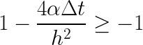

# Deriving the formula
与式左辺を差分表示すると以下のようになる.  
  
これを用いて整理すると以下のようになる.  
  
これにノイマン安定性解析を導入すると|g|は以下のように得られる.  
  
ここでcosθ=1の時が最大であり1である事は自明であるので,-1未満になる場合を考える.-1の時以下の式を満たす.  
  
更に整理すれば以下の条件が得られる.  
  