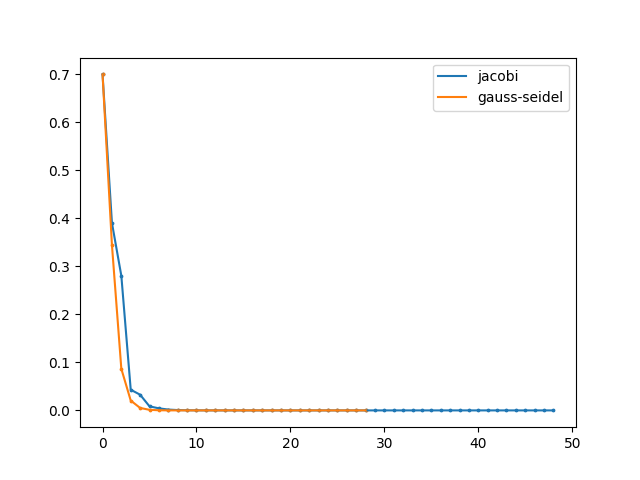

# Output
```sh
yukinishii@NM0020-no-MacBook-Air-10(14:53:16) ~/Numerical_analysis/6
% python3 prob.py                                                                                                                     [~/Numerical_analysis/6][master]
Since matrix A is a diagonally dominant matrix, the Jacobi method can be used
Trial Num : 48
Answer by Jacobi method is [ 0.03508772 -0.23684211  0.65789474]
Difference between answer and true value : [0. 0. 0.]
Trial Num : 28
Answer by Gauss Seidel method is [ 0.03508772 -0.23684211  0.65789474]
Difference between answer and true value : [3.46944695e-17 0.00000000e+00 1.11022302e-16]
```

Gauss Seidel法の方がJacobi法よりずっと早く収束していることが分かる.