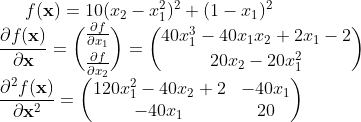

# Deriving the formula


# Output
```sh
yukinishii@NM0020-no-MacBook-Air-10(15:46:23) ~/Numerical_analysis/7
% python3 prob.py
Trial Num : 290
X^0:[-1.92682927  3.70731707]
Trial Num : 7647
X^1:[ 0.71691066 -6.4753999 ]
Trial Num : 34
X^2:[0.71892142 0.51684396]
Trial Num : 1183
X^3:[0.99997727 0.92096215]
Trial Num : 950
X^4:[0.99998608 0.99997216]
```