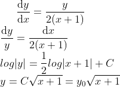

# Deriving the formula


# Output
```sh
yukinishii@NM0020noAir10(14:39:02) ~/Numerical_analysis/8
% python3 prob.py
Input n :10
f(10) :3.3166247903554
f(10) caluculated with euler method :3.7001380920410156
diff :0.3835133016856158
f(10) caluculated with heun method :3.3932808853930285
diff :0.07665609503762871
f(10) caluculated with runge kutta method :3.2763384669198783
diff :0.04028632343552152
```
